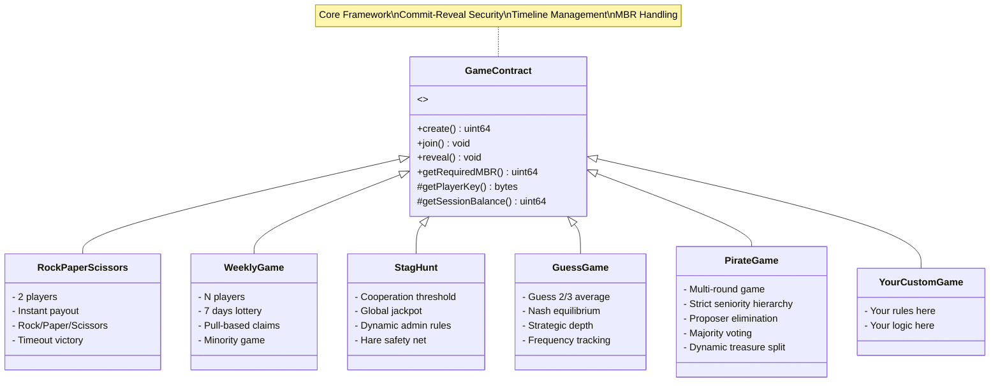

# Algorand Commit-Reveal Core

A TypeScript architectural framework for Algorand implementing the Commit-Reveal pattern. Provides a secure abstract contract for building anti-frontrunning on-chain games.

## 🛡️ Why Commit-Reveal?

On public blockchains, the Mempool is transparent. If a game broadcasts moves in clear text (e.g., "Rock"), an adversary or bot can observe the pending transaction and send a winning counter-move (e.g., "Paper"). This makes strategy games impossible.

**The Framework Solution** natively implements the Commit-Reveal schema to ensure fairness:

- **Commit Phase**: Players send only the Hash of their move (SHA256(choice + salt)). The information is on-chain, but secret.
- **Reveal Phase**: Only after the commit phase is closed, players reveal the move and salt. The contract mathematically verifies they match the original hash.

## 🏗️ Architecture Design

The architecture follows a rigorous Object-Oriented pattern to maximize security and code reuse.

### Abstract GameContract (The Parent)

Handles low-level infrastructure complexity:

- **State Management**: Base Algorand Box management and precise MBR calculation
- **Security**: Cryptographic hash verification and anti-replay protection
- **Timeline**: Block round control for phase opening and closing

### Concrete Contracts (The Children)

Inherit from the parent and focus only on game logic:

- **RockPaperScissors**: 2-player game with instant winner determination and timeout victory
- **WeeklyGame**: Multi-player lottery where players choose days of the week (minority game)
- **StagHunt**: Cooperation game with threshold mechanics and global jackpot accumulation
- **GuessGame**: Classic "Guess 2/3 of the Average" - game theory with Nash equilibrium
- **PirateGame**: Multi-round game. Dynamic treasure split

### Pull-Based Prize Claiming
Security and scalability are paramount. All games in this framework strictly implement a **Pull-Based** logic for prize distribution. The smart contracts will *never* automatically push winnings to user wallets. Instead, users must explicitly call a `claim` method to retrieve their funds. This prevents hitting opcode limits during mass distributions, simplifies MBR accounting, and eliminates push-based attack vectors.



## 📁 Project Structure

```
smart_contracts/
    ├── index.ts                      # Deploy orchestrator (entry point)
    ├── abstract_contract/
    │   └── contract.algo.ts          # Abstract Smart Contract Logic
    ├── RockPaperScissors/
    │   ├── contract.algo.ts          # Smart Contract
    │   ├── deploy-config.ts          # Configuration
    │   └── contract.e2e.spec.ts      # Tests
    ├── weeklyGame/
    │   ├── contract.algo.ts
    │   ├── deploy-config.ts
    │   └── contract.e2e.spec.ts
    ├── stagHunt/
    │   ├── contract.algo.ts
    │   ├── deploy-config.ts
    │   └── contract.e2e.spec.ts
    ├── guessGame/
    │   ├── contract.algo.ts
    │   ├── deploy-config.ts
    │   └── contract.e2e.spec.ts
    ├── pirateGame/
    │   ├── contract.algo.ts
    │   ├── deploy-config.ts
    │   └── contract.e2e.spec.ts
    └── artifacts/                    # Auto-generated during compilation
```
## 💻 Development Commands

Since prerequisites are handled in the root README, here are the specific commands for developing within this folder:

### Local Environment Setup

Before compiling or running any tests, you must have a local Algorand network running. We use AlgoKit to manage this environment:

```bash
algokit localnet start   # Starts the local Algorand node
algokit localnet reset   # Resets the chain state (crucial between test runs)
```
## Running Tests

To ensure logic integrity:

```bash
npm test                              # All tests
npm test -- stagHunt                  # Specific game
```

## Compiling Atrifacts

If you modify the contracts, regenerate the TEAL and Clients:

```bash
npm run build
```

**Note**: The artifacts/ folder is automatically generated and contains TEAL files and typed TypeScript clients for interacting with contracts.

## 💻 Usage Examples

To ensure security (Anti-Frontrunning), the client does NOT send the move in clear text. It must calculate the hash locally and send only that.

### Phase 1: Commit

```typescript
import { sha256 } from 'js-sha256';
import { algosdk } from 'algosdk';

// 1. User chooses move (e.g., 0 = Rock)
const myChoice = 0;

// 2. Generate a secret "Salt"
// IMPORTANT: The client must save this value, it will be needed for reveal!
const mySalt = new Uint8Array(32);
crypto.getRandomValues(mySalt);

// 3. Create payload
const choiceBytes = algosdk.encodeUint64(myChoice);
const dataToHash = new Uint8Array([...choiceBytes, ...mySalt]);

// 4. Calculate SHA256 Hash
const commitHash = sha256.array(dataToHash);

// 5. Send ONLY the hash to blockchain
await appClient.joinSession({
  sessionID: 123,
  commit: commitHash,
  payment: algosdk.makePaymentTxnWithSuggestedParamsFromObject({ ... })
});
```

### Phase 2: Reveal

```typescript
// When commit phase is closed, send clear data for verification
await appClient.revealMove({
  sessionID: 123,
  choice: myChoice, // 0
  salt: mySalt, // The salt generated earlier
})
```

## 🎮 Implemented Games

### 🪨 RockPaperScissors

Classic 2-player game with instant winner determination.

**Features:**
- 2-player maximum per session
- Instant winner determination after both reveals
- Winner must pull/claim the full pot (or 50/50 split on tie)
- Timeout victory mechanism if the opponent fails to reveal

**Game Flow:**
1. Two players commit (Rock=0, Paper=1, Scissors=2)
2. After commit deadline, both reveal
3. Contract determines winner immediately
4. Winner claims the pot via a pull transaction
5. Timeout victory available if opponent doesn't reveal

### 📅 WeeklyGame

Multi-player lottery where players choose days of the week.

**Features:**
- Unlimited players per session
- Prize pool distributed across active days
- Pull-based prize claiming
- Minority game mechanics

**Strategy:** Fewer competitors on your day = bigger share

**Example:**
```
7 players, 70 ALGO pot
- Monday: 3 players
- Tuesday: 2 players  
- Wednesday: 2 players

3 active days → 23.33 ALGO per day
Tuesday players: 23.33 / 2 = 11.66 ALGO each (BEST!)
```

### 🦌 StagHunt

Cooperation game with threshold mechanics inspired by game theory's assurance game.

**Features:**
- Dynamic cooperation threshold (default 51%)
- Global jackpot accumulation
- Safety net for risk-averse players
- Admin-configurable rules

**Two Choices:**

1. **HARE (0)**: Safe choice
   - Always get 80% refund
   - Guaranteed small loss: -20% ALGO

2. **STAG (1)**: Risky cooperation
   - Need threshold % of players to also choose Stag
   - If threshold MET: Split pot + jackpot (BIG WIN)
   - If threshold MISSED: Lose everything

**Example:**
```
4 players, 40 ALGO pot, threshold 51%
Choices: 3 Stags, 1 Hare

Cooperation: 75% ≥ 51% → SUCCESS!

Payouts:
- Hare: 8 ALGO refund
- Each Stag: ~10.66 ALGO + jackpot share
```

### 🎯 GuessGame

"Guess 2/3 of the Average" - classic game theory experiment.

**Mechanics:**
1. Players choose a number (0-100)
2. Average calculated
3. Target = 2/3 × Average
4. Closest to target wins

**Strategy:**
- **Nash Equilibrium**: 0
- **Reality**: Most play 15-40 range
- Game theory depth testing

**Example:**
```
Players: [0, 33, 50, 67, 100]
Average: 50
Target: 33

Winner: Player who chose 33
```
### 🏴‍☠️ PirateGame

Classic cutthroat game theory problem of wealth distribution, strict hierarchy, and survival.

**Features:**
- Strict seniority hierarchy
- Proposer elimination mechanism
- Majority voting requirements
- Dynamic treasure split

**Mechanics:**
1. The most senior surviving pirate (Captain) proposes how to split the pot.
2. All surviving pirates vote on the proposal (Yes/No).
3. If ≥ 50% vote YES: The pot is split exactly as proposed and the game ends.
4. If < 50% vote YES: The Captain is thrown overboard (eliminated), and the next most senior pirate makes a new proposal.

**Example (Nash Equilibrium):**
```text
5 Pirates (P1 to P5, P1 being most senior), 100 ALGO pot.

P1's optimal proposal to survive and maximize profit:
- P1: 98 ALGO
- P2: 0 ALGO
- P3: 1 ALGO
- P4: 0 ALGO
- P5: 1 ALGO

Votes YES: P1, P3, P5 (3/5 = 60% majority)
Result: Proposal passes! P1 takes almost everything. P3 and P5 take 1 ALGO (which is better than the 0 they would get if P2 became captain).
```


## 🛠️ Extending the Framework

### Creating a New Game

When creating a new game, you inherit from `GameContract` and implement your specific logic, including custom MBR calculations and the pull-based claiming system.

```typescript
import { assert, BoxMap, bytes, Global, gtxn, itxn, Txn, uint64 } from '@algorandfoundation/algorand-typescript';
import { Address } from '@algorandfoundation/algorand-typescript/arc4';
import { GameConfig, GameContract } from '../abstract_contract/contract.algo';

export class YourGame extends GameContract {
  // 1. Add your game-specific BoxMaps
  customData = BoxMap<uint64, YourDataType>({ keyPrefix: 'cus' });
  
  // 2. Override createSession for additional MBR/storage
  public createSession(config: GameConfig, mbrPayment: gtxn.PaymentTxn): uint64 {
    const requiredMBR = this.getRequiredMBR('newGame');
    assert(mbrPayment.receiver === Global.currentApplicationAddress, 'MBR to contract');
    assert(mbrPayment.amount >= requiredMBR, 'Insufficient MBR for session');

    const sessionID = super.create(config);
    this.customData(sessionID).value = 0; // Initialize your boxes
    
    return sessionID;
  }
  
  // 3. Expose and wrap standard phase methods
  public joinSession(sessionID: uint64, commit: bytes, payment: gtxn.PaymentTxn): void {
    super.join(sessionID, commit, payment);
  }

  public revealMove(sessionID: uint64, choice: uint64, salt: bytes): void {
    super.reveal(sessionID, choice, salt);
    // Add your custom reveal logic here (e.g., tracking choices)
    this.customData(sessionID).value += 1;
  }

  // 4. Implement Pull-Based Prize Distribution
  public claimWinnings(sessionID: uint64): uint64 {
    assert(this.sessionExists(sessionID), 'Session does not exist');
    
    const playerAddr = new Address(Txn.sender);
    const playerKey = this.getPlayerKey(sessionID, playerAddr);
    assert(this.playerChoice(playerKey).exists, 'Player has not revealed or already claimed');

    // Your custom game logic to determine if the player won
    const myChoice = this.playerChoice(playerKey).value;
    const isWinner = myChoice === 1; // Example condition
    assert(isWinner, 'You did not win');

    const prizeAmount = this.getSessionBalance(sessionID); // Calculate actual share

    // CRITICAL: Cleanup state to prevent double-claiming attacks
    this.playerChoice(playerKey).delete();

    // Send winnings via inner transaction (Pull)
    itxn.payment({
      receiver: playerAddr.native,
      amount: prizeAmount,
      fee: 0,
    }).submit();

    return prizeAmount;
  }
  
  // 5. Calculate additional MBR requirements for your custom BoxMaps
  public getRequiredMBR(command: 'newGame' | 'join'): uint64 {
    if (command === 'newGame') {
      // Custom Box: Key (8 bytes sessionID) + Your data type Value 
      const customMBR = this.getBoxMBR(8, X); 
      return customMBR + super.getRequiredMBR('newGame');
    }
    return super.getRequiredMBR(command);
  }
}
```
## 🔒 Security Features

- **Anti-Frontrunning**: Commit-Reveal pattern prevents move prediction
- **Anti-Replay**: Player data cleanup after prize distribution
- **Timeline Enforcement**: Strict phase-based access control
- **MBR Management**: Precise storage cost calculation and handling
- **Hash Verification**: SHA256 integrity
- **Timeout Protection**: Anti-griefing
